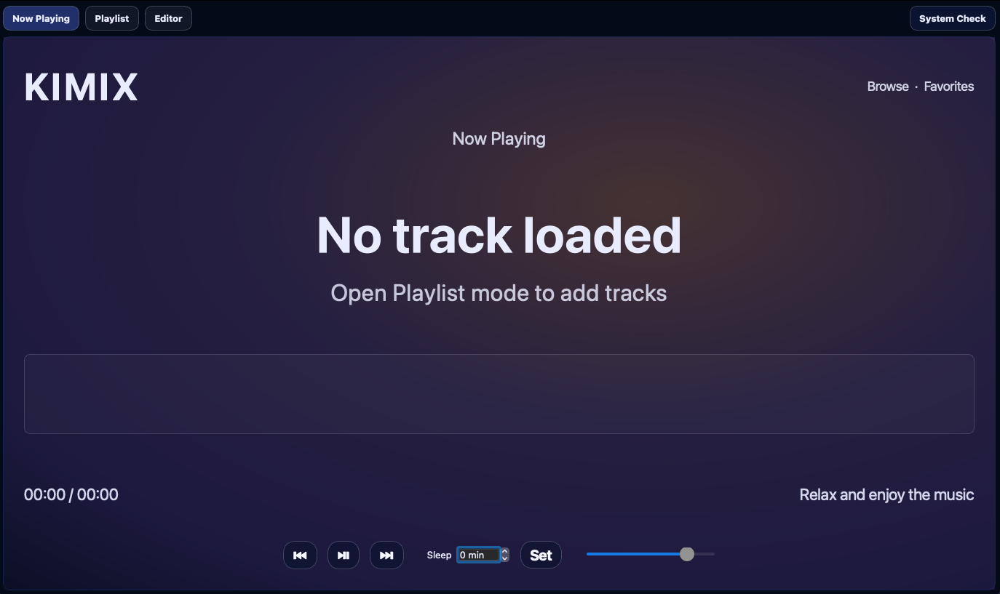
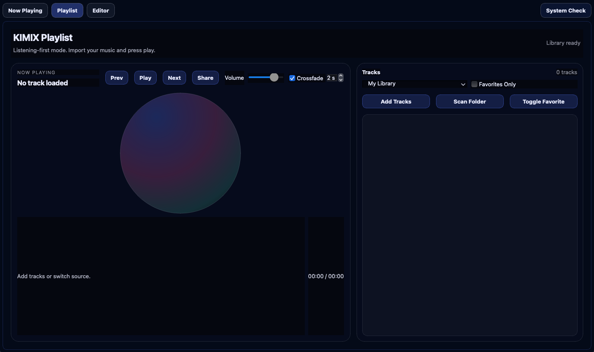
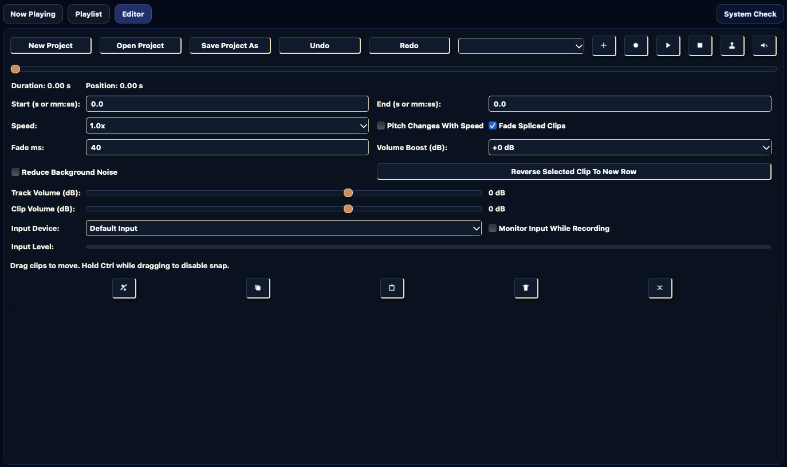

# KIMIX v1.0

## Project Overview

KIMIX v1.0 is a desktop audio platform built around a listening-first workflow with a full editor available as a power mode.

Core architecture:

- `Now Playing`: immersive playback UI
- `Playlist`: local/featured library browsing, queue-style playback, favorites, share/copy track info
- `Editor`: multi-track, timeline-based audio editing and export

Tech stack:

- Python 3.11/3.12
- PyQt5 (GUI + multimedia)
- pydub (audio processing/export)
- simpleaudio (editor playback)
- sounddevice + numpy (microphone recording)

## v1.0 Capability Summary

### Listening and Library

- Add local tracks and scan folders for supported formats
- Background import with progress + cancel
- Waveform/duration index cache (`~/.kimix/library_index.json`)
- Favorites and Favorites-only filtering
- Listening history and session restore
- Optional crossfade (1–5 seconds)
- Next-track preloading for low-latency transitions
- Sleep timer and share-track-info action

### Editor and Production

- Multi-project editing with autosave
- Multi-track layering with timeline rows
- Cut, copy, paste, split, delete, reverse-to-new-row
- Track drag/reorder, rename, mute
- Clip snapping with modifier override for intentional gaps
- Playback speed controls and pitch behavior toggle
- Fade handling for spliced clips
- Noise reduction and volume boost
- Per-track and per-clip volume controls
- Non-destructive source metadata model:
  - source file path
  - source in/out ranges
  - reverse state
- Source-based reconstruction during render/export with fallback media cache
- Background export with progress and cancel
- Undo/redo support for timeline operations

### Recording

- Microphone recording into new timeline rows
- Input device selection
- Monitoring toggle
- Live level meter

### UX and Operations

- System Check diagnostics panel (Python, ffmpeg, pydub, Qt multimedia, mic stack)
- Persistent app state under `~/.kimix`
- Build scripts for packaging desktop binaries

## Screenshots

### Now Playing

### Playlist

### Editor

## Repository

Target repository: `https://github.com/robbiecalvin/KIMIX`
